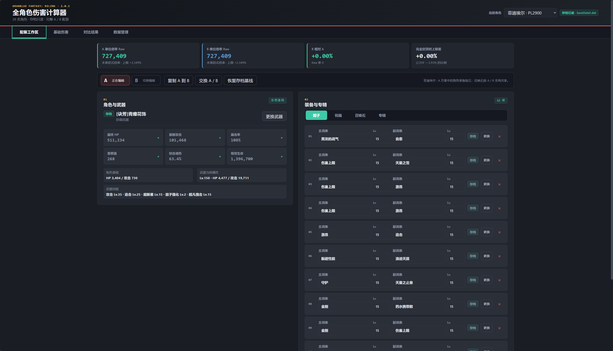
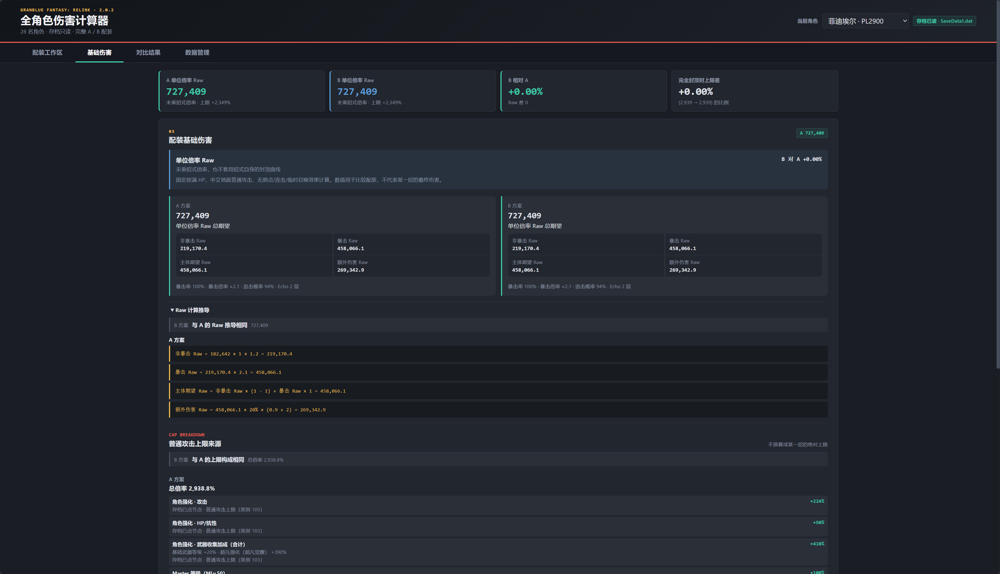
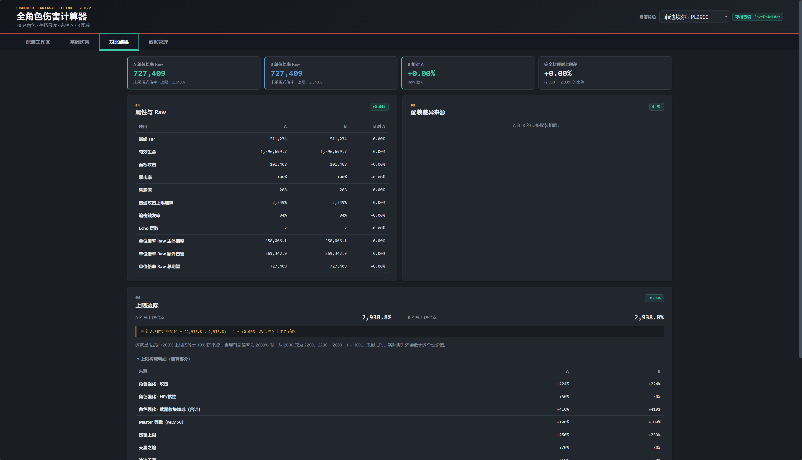
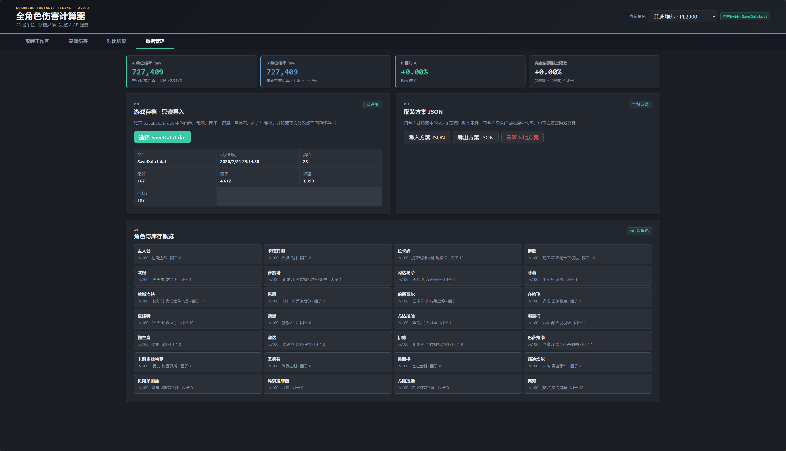

# 碧蓝幻想 Relink 全角色伤害计算器

面向《碧蓝幻想 Relink》2.0.2（无尽黄昏）的本地配装计算器。读取游戏存档后，可查看 28 名角色的当前装备与面板，并直接比较 A / B 两套因子、祝福、召唤石及专精方案。

> 非官方玩家工具，与 Cygames 或游戏发行方无关。游戏名称、文本和相关数据的权利归其各自权利人所有。

## 开箱即用

无需安装 Node.js、Python，也无需启动本地服务器。

1. 下载并解压项目。
2. 双击 `index.html`，使用 Chrome、Edge 等现代 Chromium 浏览器打开。
3. 进入「数据管理」，选择游戏的 `SaveData1.dat`。
4. 选择角色，在 A / B 方案中更换因子、祝福或召唤石，结果会即时更新。

存档只在浏览器本地读取，不会上传，也不会修改或写回游戏存档。Windows 默认存档目录：

```text
C:\Users\<用户名>\AppData\Local\GBFR\Saved\SaveGames\SaveData1.dat
```

## 功能

- 读取 28 名角色、武器、因子、祝福、召唤石和角色强化进度。
- 按角色还原 HP、面板攻击、暴击率、昏厥值、防御与有效生命。
- 完整 A / B 配装编辑与差异对比，每套召唤石方案在所有角色间共享。
- 展示单位倍率 Raw、额外伤害 Raw、普通攻击上限及逐项计算来源。
- 支持本地方案 JSON 导入与导出；它与只读游戏存档导入相互独立。
- 可从存档库存选择已有装备，也可建立虚拟装备进行试配。

Raw 结果固定按满 HP、中立地面普通攻击、无弱点、无连击叠层、无临时召唤效果计算。它用于比较配装，不代表某个具体动作或技能的最终逐击伤害。

## 界面预览

### 配装工作区



### 基础伤害与公式来源



### A / B 对比



### 存档导入与角色概览



## 文件结构

```text
.
├── index.html                 # 直接打开的程序入口
├── assets/
│   ├── app.bundle.js         # 浏览器直接运行的打包文件
│   ├── styles/               # 主界面与响应式样式
│   └── screenshots/          # README 截图
├── src/
│   ├── core/                 # 面板、伤害与配装计算
│   ├── data/                 # 2.0.2 静态目录数据
│   ├── save/                 # 只读存档解析与进度映射
│   ├── storage/              # 浏览器本地存储
│   ├── ui/                   # 页面渲染与交互
│   └── shared/               # 通用格式化与集合工具
├── README.md
└── LICENSE
```

仓库不包含玩家存档、研究过程、提取工具、测试快照、IDE 配置或其他临时文件。

## 许可

本项目源码采用 [MIT License](LICENSE) 发布。游戏相关名称、文本与数据不因本许可而改变其原有权利归属。
